<p align="center">
  
  
  
  
</p>

<h1 align="center">SupplySentinel</h1>
<h3 align="center">India's Open-Source Weapon Against Black Marketing</h3>

<p align="center">
  <strong>A citizen-powered price transparency platform that lets any Indian district<br>
  expose, track, and fight black marketing of essential commodities — for free, forever.</strong>
</p>

<p align="center">
  <a href="https://supplysentinel.netlify.app">
    
  </a>
</p>

<p align="center">
  <em>Born in Balangir, Odisha. Built for 780+ districts across India.</em>
</p>

---

## India Has a Black Market Problem

Every time a supply chain crisis hits — a global oil shock, a transport strike, a monsoon disruption — the same story repeats across India:

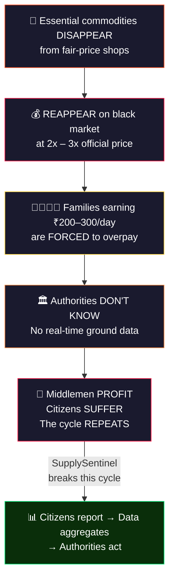

**There is no nationwide system for citizens to report, aggregate, and escalate price violations at the speed they happen.** SupplySentinel is that system.

---

## The Balangir Story — Where It Started

### March 2026, Balangir District, Odisha

```mermaid
block-beta
    columns 3
    block:official["🏛️ OFFICIAL PRICE"]:1
        LPG1["LPG ₹939"]
        Oil1["Mustard Oil ₹145"]
        Onion1["Onion ₹40"]
        Tomato1["Tomato ₹35"]
    end
    block:arrow["⚡ BLACK MARKET"]:1
        gap1["→ ₹2,500+ (167%↑)"]
        gap2["→ ₹210 (45%↑)"]
        gap3["→ ₹65 (63%↑)"]
        gap4["→ ₹80 (129%↑)"]
    end
    block:impact["💔 HUMAN COST"]:1
        cost1["A worker's ENTIRE<br>WEEK'S salary<br>for ONE LPG cylinder"]
    end

    style official fill:#0d2818,stroke:#00e676,color:#e8eaf0
    style arrow fill:#2e1a0a,stroke:#ff4d1c,color:#e8eaf0
    style impact fill:#2e0a0a,stroke:#ff1744,color:#e8eaf0
```

When this crisis hit Balangir, there was **no way** for citizens to:
- Report overpricing anonymously (without fear of retaliation)
- See if others in their area faced the same problem
- Generate evidence strong enough for authorities to act
- Alert their community in real time

**So we built SupplySentinel.** The Balangir edition is live at [supplysentinel.netlify.app](https://supplysentinel.netlify.app) — designed so that **any district in India** can deploy their own version in under 10 minutes.

> *"When a daily-wage worker pays ₹2,500 for a ₹939 LPG cylinder, that's not just inflation — that's exploitation. SupplySentinel gives citizens a weapon: DATA."*
> — **Aswini Behera**, Creator, Balangir, Odisha

---

## How It Works

### The Citizen Data Pipeline

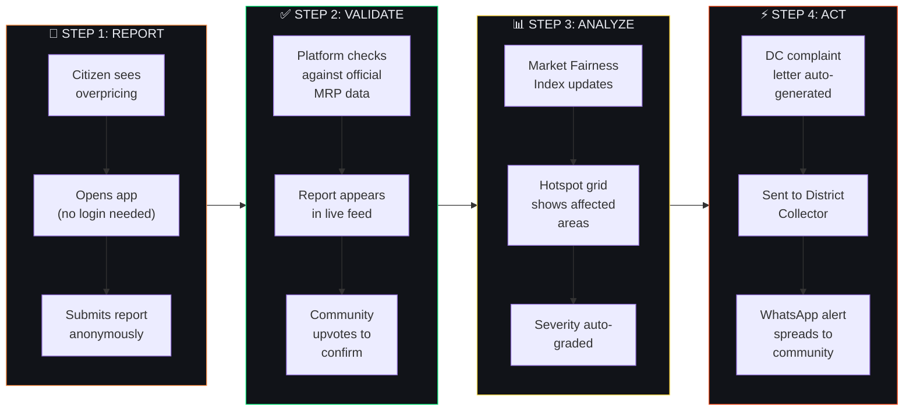

### What Makes This Different?

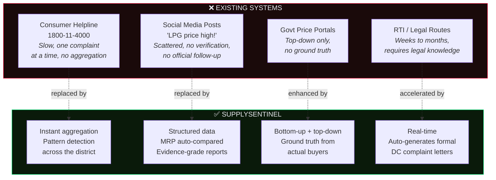

---

## The Market Fairness Index (MFI)

The core intelligence of SupplySentinel. A single **0–100 score** that answers: *"Is my local market fair right now?"*

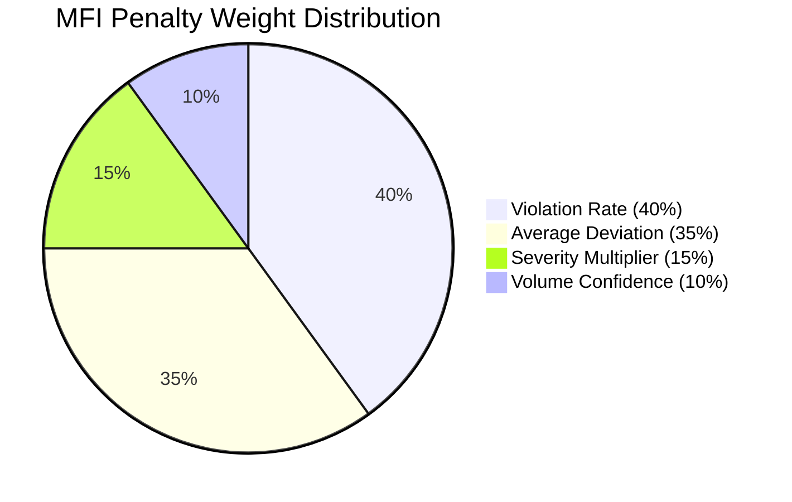

### How It's Calculated

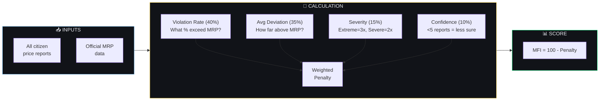

### Score Interpretation

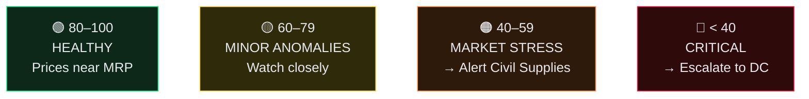

> **Balangir right now: MFI = 38/100 — 🔴 CRITICAL**
> LPG supply constrained, active black marketing detected in Gandhi Chowk, Bus Stand Area, Cantonment Road.

---

## Platform Vision — The Full Picture

### MVP (Live Now) vs. v1.0 (Building)

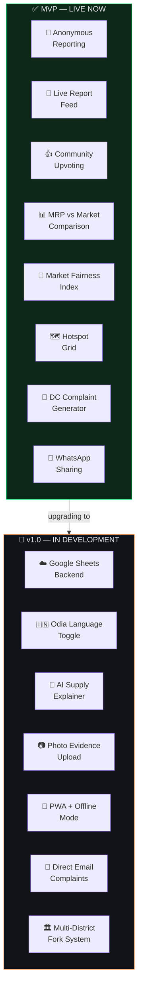

### System Architecture

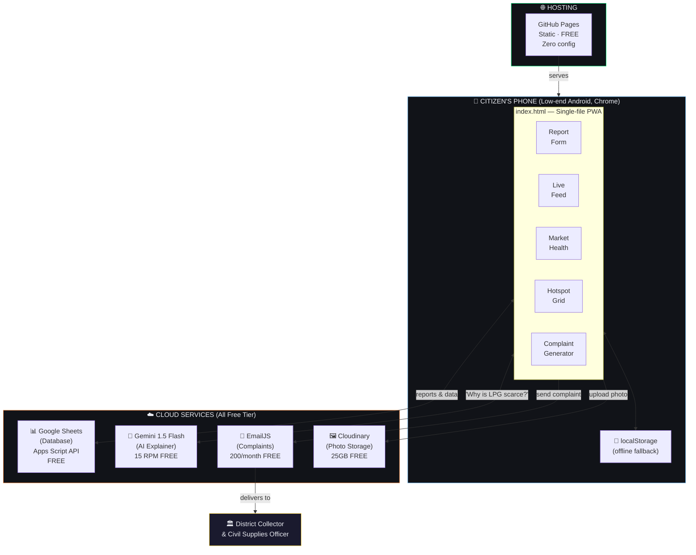

---

## User Journey — A Citizen in Balangir

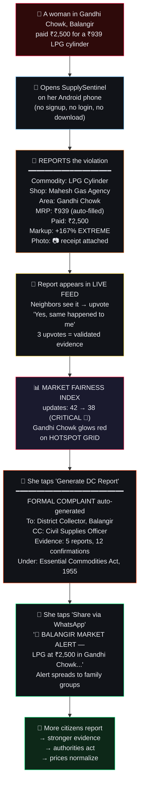

---

## The India Opportunity

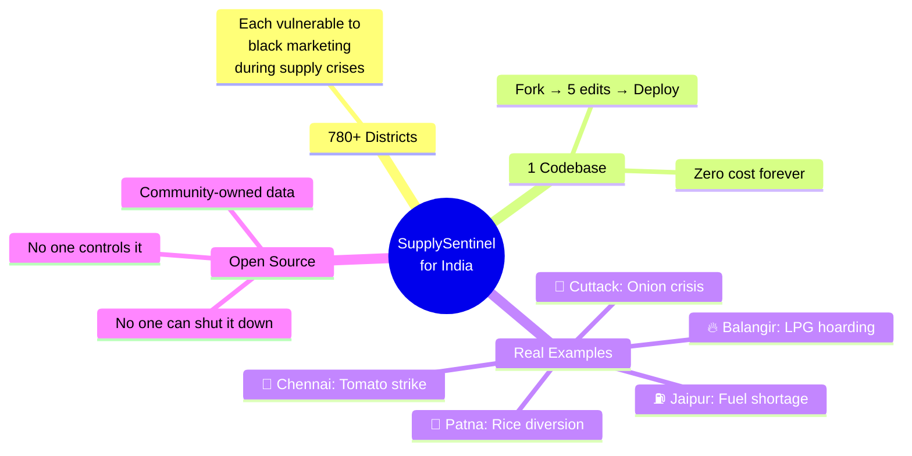

### Commodities Tracked (Balangir Example)

Each district customizes this list via config. Here's what Balangir tracks:

| Commodity | Official MRP | Unit | Source |
|-----------|-------------|------|--------|
| LPG Cylinder (14.2kg) | ₹939 | per cylinder | [PPAC](https://ppac.gov.in) |
| Mustard Oil | ₹145 | per liter | [Consumer Affairs](https://consumeraffairs.nic.in/price-monitoring-cell) |
| Sugar | ₹42 | per kg | Consumer Affairs |
| Rice | ₹38 | per kg | [Food Odisha](http://www.foododisha.in) |
| Wheat Atta | ₹35 | per kg | Consumer Affairs |
| Onion | ₹40 | per kg | Consumer Affairs |
| Tomato | ₹35 | per kg | Consumer Affairs |
| Toor Dal | ₹155 | per kg | Consumer Affairs |
| Petrol | ₹105 | per liter | [PPAC](https://ppac.gov.in) |

*Prices as of March 2026 for Odisha. Other states update via their own config file.*

---

## Development Roadmap

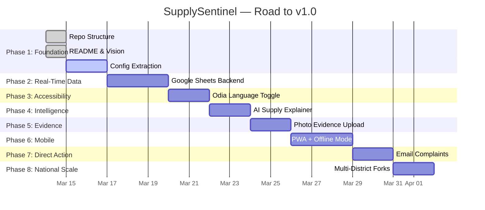

### Detailed Task Breakdown

| Phase | Task | Status | Description |
|-------|------|--------|-------------|
| **1. Foundation** | Repo Structure | ✅ Done | `config/`, `data/`, `docs/`, LICENSE |
| | README & Vision | ✅ Done | You're reading it |
| | Config Extraction | ⬜ Next | `balangir.json` powers everything |
| **2. Real-Time Data** | Google Sheets Backend | ⬜ Planned | Replace localStorage with shared DB |
| **3. Accessibility** | Odia Language | ⬜ Planned | `[EN \| ଓଡ଼ିଆ]` full translation |
| **4. Intelligence** | AI Explainer | ⬜ Planned | Gemini-powered crisis explanations |
| **5. Evidence** | Photo Upload | ⬜ Planned | Camera → attach to reports |
| **6. Mobile** | PWA + Offline | ⬜ Planned | Installable, works without internet |
| **7. Direct Action** | Email Complaints | ⬜ Planned | One-click send to DC via EmailJS |
| **8. National Scale** | Multi-District | ⬜ Planned | Fork → 5 edits → deployed |

---

## Deploy for Your District

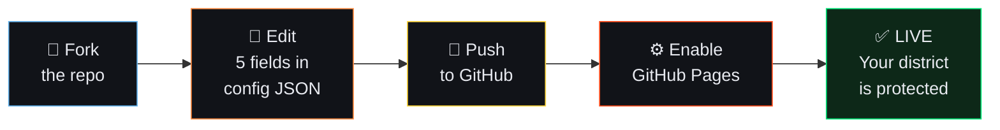

### The 5 Fields to Change

| # | Field | Balangir (example) | Your District |
|---|-------|--------------------|---------------|
| 1 | `"district"` | `"Balangir"` | `"Cuttack"` |
| 2 | `"state"` | `"Odisha"` | `"Odisha"` |
| 3 | `"areas"` | `["Gandhi Chowk", ...]` | `["Buxi Bazaar", ...]` |
| 4 | `"officialContacts"` | Balangir DC email | Your DC's email |
| 5 | `"commodities"` | Odisha prices | Your state's prices |

```bash
# Quick Start
git clone https://github.com/YOUR-USERNAME/Supplysentinel.git
cp config/balangir.json config/your-district.json
# Edit the 5 fields → push → enable Pages → LIVE
```

See [docs/DEPLOY.md](docs/DEPLOY.md) for step-by-step instructions.

---

## Deployed Instances

| District | State | Maintainer | Status | Link |
|----------|-------|------------|--------|------|
| Balangir | Odisha | [@Ab-aswini](https://github.com/Ab-aswini) | 🔴 LIVE | [Visit](https://supplysentinel.netlify.app) |

> **Deployed for your district?** Add a row and submit a PR. Let's build a national network.

---

## Tech Stack

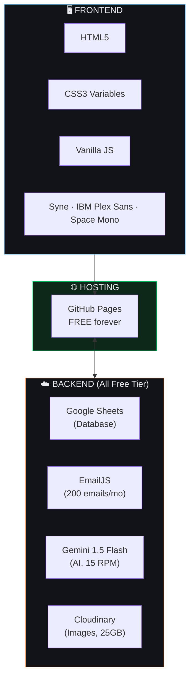

<p align="center"><strong>No npm. No build tools. No frameworks. No paid services. Total cost: ₹0/month.</strong></p>

---

## Screenshots

> Screenshots will be added after v1.0 UI polish. For now, visit the live demo.

| Dashboard & Market Health | Report Form & Live Feed | Hotspot Grid & Complaint |
|---------------------------|-------------------------|--------------------------|
| [Live Demo](https://supplysentinel.netlify.app) | [Live Demo](https://supplysentinel.netlify.app) | [Live Demo](https://supplysentinel.netlify.app) |

---

## Contributing

This is a citizen utility, not a tech showcase. We need:

| Role | How You Can Help |
|------|-----------------|
| **Developers** | Vanilla HTML/CSS/JS only. See [CONTRIBUTING.md](docs/CONTRIBUTING.md) and the full [PRD](docs/PRD.md) |
| **Translators** | Hindi, Odia, Telugu, Tamil, Bengali, Marathi, Kannada... |
| **Citizens** | Deploy for your district. Report prices. Spread awareness |
| **Data Verifiers** | Keep official MRP data current from govt sources |
| **Designers** | Mobile UX improvements for low-end Android phones |

---

## Why Open Source?

> Black markets thrive on **information asymmetry**. Citizens can't see what others are paying. Authorities can't see what's happening on the ground. Middlemen exploit the gap.
>
> SupplySentinel is open source because **price transparency shouldn't be a luxury — it should be public infrastructure.**
>
> No single entity controls it. No one can shut it down. No one profits from it. The code is free. The hosting is free. The data belongs to citizens.
>
> **The fight against black marketing is a collective fight. Open source makes it collective by design.**

---

## Official Data Sources

| Source | URL | Provides |
|--------|-----|----------|
| PPAC (Petroleum Planning) | [ppac.gov.in](https://ppac.gov.in) | LPG, Petrol, Diesel prices |
| Consumer Affairs Ministry | [consumeraffairs.nic.in](https://consumeraffairs.nic.in/price-monitoring-cell) | Essential commodity MRPs |
| Odisha Food Supplies | [foododisha.in](http://www.foododisha.in) | State PDS & ration prices |
| National Consumer Helpline | **1800-11-4000** (toll-free) | Complaint registration |

---

## Contact

| | |
|---|---|
| **Creator** | Aswini Behera |
| **Email** | aswinibehera666@gmail.com |
| **Location** | Balangir, Odisha, India |
| **Repo** | [github.com/Ab-aswini/Supplysentinel](https://github.com/Ab-aswini/Supplysentinel) |
| **Live Demo** | [supplysentinel.netlify.app](https://supplysentinel.netlify.app) |

---

<p align="center">
  <strong>Born in Balangir. Built for India.</strong><br>
  <em>Because no family — anywhere — should pay ₹2,500 for a ₹939 cylinder.</em>
</p>

<p align="center">
  
  
  
</p>
